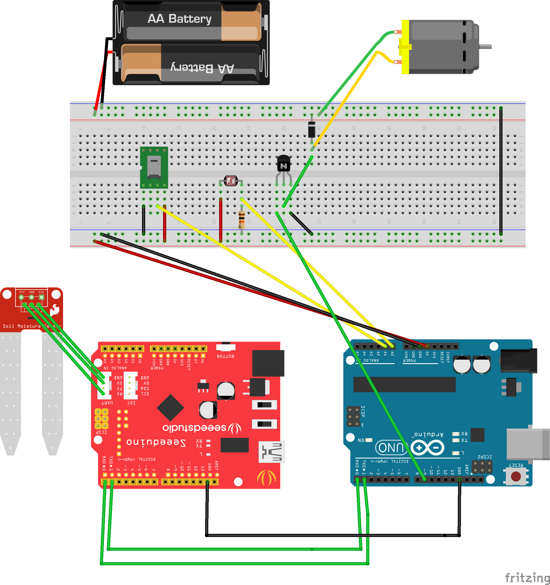

# Smart Garden/Irrigation System

## Project Overview
For both home and industrial use soil monitoring and plant irrigation is an extremely important role for establishing crops and flowers for use. Due to weather changes, time consumption and a lack of detailed data, it can often be difficult to assess the best time to water or feed your vegetation to get the best result. 

The project is aimed at using the internet of things in order to create a device that can report multiple factors to determine the best time to water plants and achieve maximum yield. These include rainfall, sunlight and soil chemical data. All this information was passed to a device, which would then provide the user the means to active a sprinkler system to immediately tend to the issues. This also involves communication between the sensors and the sprinklers so that the user can set an automated system that manages to water based on the sensor data with no input from the user.

## Prerequisite
#### Hardware
* 2X Arduino Uno - For rreading sensor and transfer the data over XBee
* 3X XBees, a XBee adapter, and two XBee shields- for communication between devices
* Moisture sensor
* Seeduino - For connecting moisture sensor to arduino
* Humidity sensor
* Light Intensity sensor
* LED/Motor/Servo - To use as an indicator to simulate a sprinkle

Below is an exmaple diagram for device B
 


* Arduino IDE
	* Seeduino Libraries
    * SimpleDHT
* Processing IDE
	* giCentreUtils - For making graphs
	* Serial - For serial communcation
	* mqtt - For server/broker communication

#### Server/Broker
* OpenSSl
* Mosquitto
* Paho JS
* HTML5
* LibWebSockets

## Arduino Code
The code for arduino was very simple and straight forward. However, we have to make sure our circuit are wired correctly and everything is in working condition.
```
  Serial.print("t");
  Serial.print("a");  
  Serial.println((int)temperature);  
  Serial.print("h");  
  Serial.print("a");  
  Serial.println((int)humidity);
```
The code above is an example of how each sensor data is collected. The first character is the sensor id and second charachter is the device id and anything numrical after that are the reading of that sensor.

These reading are send to the serial and read by XBees

Processing IDE then recieves these reading as bytes from XBees
Data read from serial event is then stored
```
void serialEvent(Serial p)
{
  String valueRead = p.readStringUntil('\n');
  if (valueRead!=null)
  {
    if (valueRead.charAt(1)=='a')
    {
      switch(valueRead.charAt(0))
      {
      case 'h':
        ....
```     
It is stored twice, one for graphs and other reading log.
```
if (soilList2.size()>40)
    soilList2.remove(40);
  soilList2.add(0, moistureReading2);

  arrayCopy(humidityData, 1, humidityData, 0, humidityData.length-1);
  humidityData[99]=Float.parseFloat(humidityReading1);
```

We establish a MQTT connection. We can subscribe to topic to recieve data and send to serial / XBee

```
 client = new MQTTClient(this);
  client.connect("mqtt://10.192.67.232:9003", "Sensor1");
  client.subscribe("sprinkler");
  client.subscribe("calibrate");
```
Then we publish reading using a topic. This data is send to a broker.
```
client.publish("humidity", humidityReading1);
```
Then using javascript to establish connection with the broker we can read the data which was published by the processing IDE.

## Website
